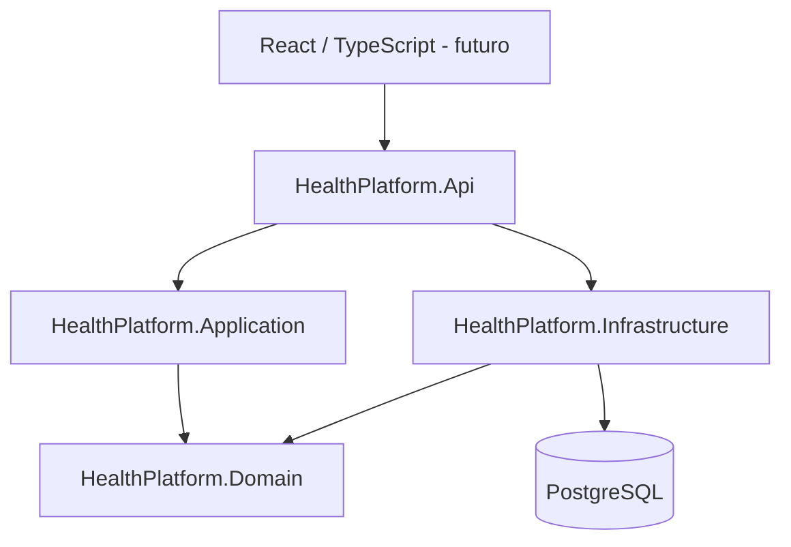
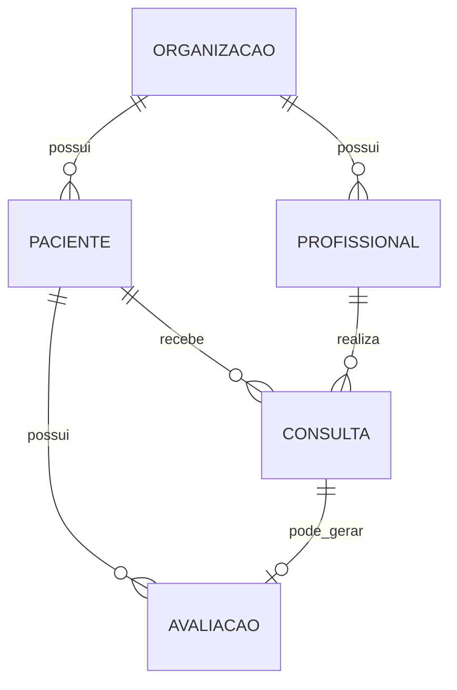

# HealthPlatform v0.1.0 — arquitetura inicial

## Relacionamentos iniciais

## Regra multi-tenant

Toda entidade clínica pertencente a uma organização deve ser consultada usando `OrganizacaoId` do usuário autenticado. Nunca confiar em um `OrganizacaoId` enviado pelo frontend.

## v0.1.3 - Anamnese estruturada

A anamnese e historica: um paciente pode possuir varias anamneses ao longo do acompanhamento, com no maximo uma anamnese vinculada a cada consulta. Campos clinicos frequentes permanecem estruturados e perguntas adicionais sao modeladas por `PerguntaAnamnese` + `RespostaAnamnesePersonalizada`, evitando alteracoes de schema para cada formulario especifico de profissional.

## v0.1.4 - Exames laboratoriais

O modulo laboratorial separa `MarcadorLaboratorial`, `ExameLaboratorial` (coleta) e `ResultadoExameLaboratorial`. Essa composicao evita colunas fixas por exame e permite historico longitudinal por marcador.

## v0.1.5 - Relatorios

`RelatorioClinico` e um snapshot imutavel. O JSON consolidado preserva o estado usado na geracao e permite evoluir templates sem reescrever relatorios antigos.

## v0.1.6 - Plano alimentar

O modulo nutricional separa catalogo e prescricao:

`Alimento -> ItemRefeicaoPlano -> RefeicaoPlanoAlimentar -> PlanoAlimentar`

Substituicoes sao filhas do item prescrito e apontam para outro alimento do mesmo catalogo. Os macros sao calculados em runtime a partir da composicao por 100 g e da `QuantidadeGramas` armazenada em cada item/substituicao.

## v0.1.7 - Metas e diario

`MetaPaciente` define o objetivo longitudinal e `RegistroMeta` guarda um unico progresso por data. `RegistroDiarioPaciente` e propositalmente generico para suportar sono, hidratacao, sintomas, humor, refeicoes e outros eventos sem criar uma tabela por tipo. O endpoint `resumo-dia` agrega metas e diario e serve de base para o futuro dashboard do paciente.

## v0.1.8 - Portal do paciente

`PortalPacienteController` funciona como uma camada de leitura agregada. Ele nao duplica dados e nao cria tabelas: consulta os modulos existentes e produz uma resposta otimizada para a futura home mobile do paciente.

## v0.1.9 - Agenda e dashboard profissional

- A entidade `Consulta` tambem e a fonte oficial da agenda.
- Datas permanecem UTC no banco; endpoints de agenda recebem `offsetMinutos` para delimitar o dia local.
- Dashboard do profissional e uma leitura agregada, sem duplicacao de dados.
- Alteracoes rapidas de status/reagendamento geram `AuditLog`.
